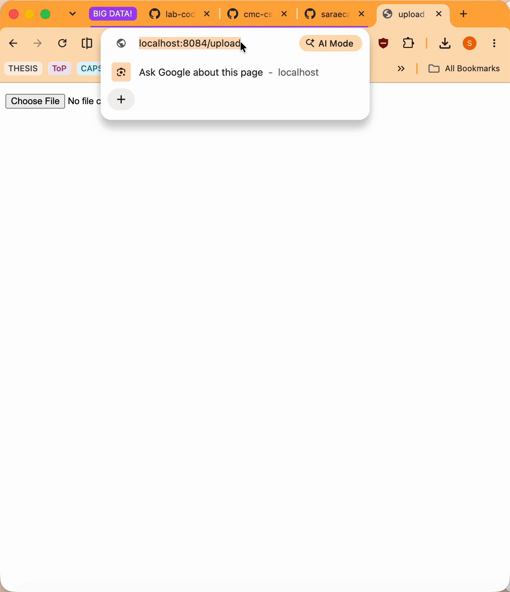

# Containerized Image Upload Web App
[](https://github.com/saraecawley/flask-on-docker/actions/workflows/build.yml)

## Overview
In this project I've containerized a Flask application with Postgres for development. Additionally, I've made a production-ready Docker Compose file that utilizes Gunicorn and Nginx to manage static and media files.

## Build Instructions

### Development

1. Clone the repo and get into the project directory

```
$ cd flask-on-docker
```

2. Configure the .env.dev file (located in project dir)

3. Build the images and run the containers:

```
$ docker compose up -d --build
```

4. Navigate to <http://localhost:5001/upload>, and once you've uploaded your image, view it at <http://localhost:5001/media/IMAGE_FILE_NAME>


### Production

1. Configure the prod environment files .env.prod and .env.prod.db (located in the project directory)

2. Build the images and run the containers:

```
$ docker compose -f docker-compose.prod.yml up -d --build
```
Test at <http://localhost:8084>. Note that changes require rebuilding and restarting production.

### Demo


